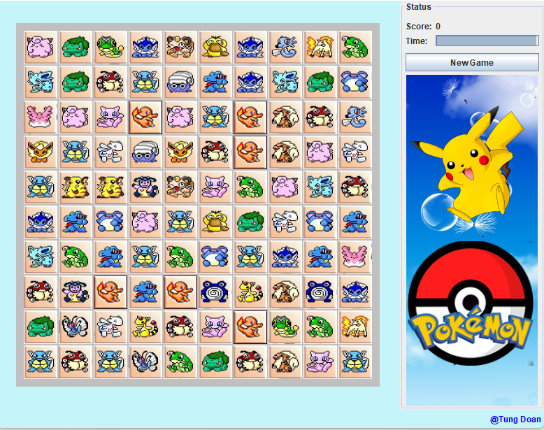

# Pokemon
A simple Java implementation for [Mahjong](https://en.wikipedia.org/wiki/Mahjong), which uses the asset of Pokemons

## Requirements for run
- Java installation including [JDK](https://www.oracle.com/java/technologies/downloads/) and [JVM](https://java.com/en/download/manual.jsp)
- Integrated Development Environment (IDE) (i.e., [Eclipse](https://www.eclipse.org/ide/), [IntelliJ](https://www.jetbrains.com/idea/), etc)

# Demo
